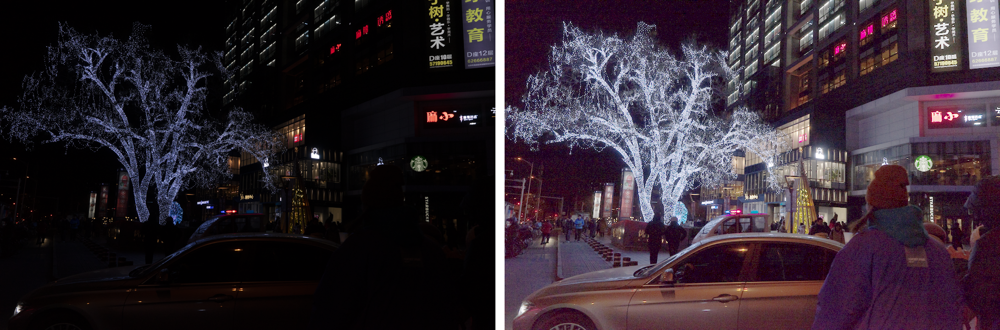
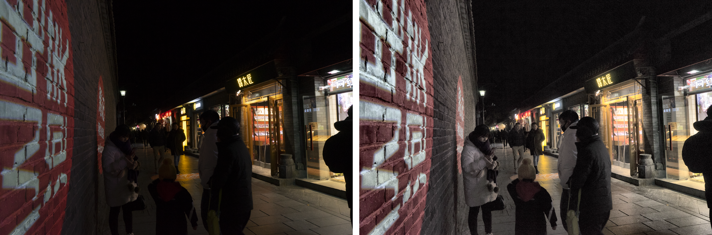
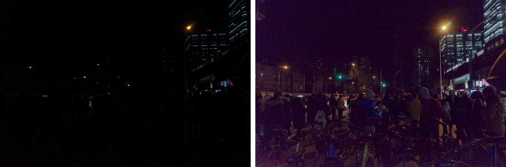
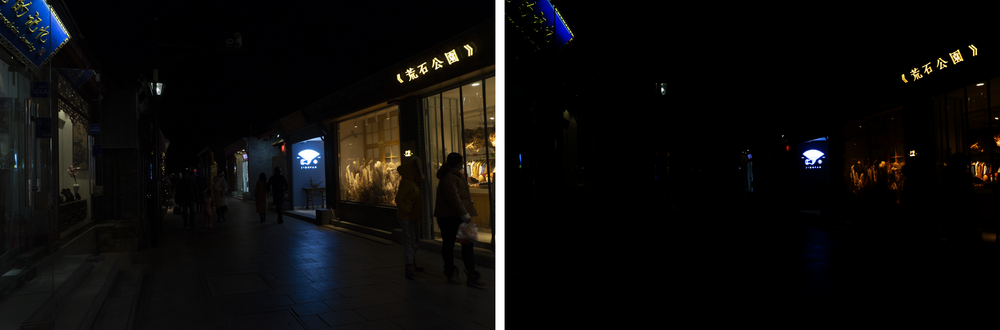

# Laboratorio de Mejora de Imagen: Operaciones Elementales

**Autor:** Juan Navarro Rodriguez
**Fecha:** 18 de Diciembre de 2024

---

## 1. Resumen

En este laboratorio se abordó la problemática de la mejora de imágenes digitales capturadas en condiciones de baja iluminación, utilizando técnicas de procesamiento elemental. Se seleccionaron cuatro imágenes de la base de datos "The Dark Face", las cuales presentan desafíos significativos de visibilidad y contraste. Se implementaron y evaluaron tres categorías de técnicas: ajuste de intensidad mediante corrección Gamma, procesamiento de histograma y operadores aritméticos de realce. Los resultados demostraron que, si bien la corrección Gamma es efectiva para recuperar información en zonas oscuras sin introducir ruido excesivo, las técnicas de ecualización de histograma, especialmente CLAHE, ofrecen un compromiso superior entre mejora del contraste local y preservación de la naturalidad de la imagen. Este estudio concluye que la elección de la técnica de mejora depende críticamente de las características del histograma original y del propósito del análisis posterior.

## 2. Introducción

El procesamiento digital de imágenes es una disciplina transversal esencial en campos tan diversos como la medicina diagnóstica, la vigilancia automatizada y la teledetección. La calidad de las imágenes adquiridas en entornos reales a menudo se ve comprometida por factores como iluminación insuficiente, ruido del sensor o bajo contraste, lo que dificulta tanto la interpretación humana como el análisis computacional.

La mejora de imagen constituye una etapa crítica del preprocesamiento, cuyo objetivo es transformar una imagen para que el resultado sea más adecuado que el original para una aplicación específica. A diferencia de la restauración de imágenes, que busca modelar y revertir degradaciones físicas, la mejora es un proceso subjetivo orientado a optimizar la percepción visual.

En este laboratorio, se exploran técnicas fundamentales de mejora aplicadas a un escenario de alta dificultad: imágenes nocturnas de la base de datos "The Dark Face". Estas imágenes se caracterizan por histogramas concentrados en los niveles bajos de intensidad, lo que oculta detalles estructurales y de textura. Se analizan métodos de transformación de intensidad, que modifican los píxeles individualmente; métodos de histograma, que consideran la distribución global o local de intensidades; y métodos aritméticos, que combinan información espacial para resaltar detalles. La justificación de este estudio radica en la necesidad de validar estrategias robustas para la recuperación de información visual en condiciones adversas.

## 3. Material y Métodos

### 3.1. Material
Se utilizaron cuatro imágenes seleccionadas de la base de datos "The Dark Face". Estas imágenes, capturadas en entornos nocturnos urbanos (calles, edificios), presentan una resolución variable y una profundidad de color de 8 bits por canal. Las imágenes se caracterizan por una iluminación extremadamente baja y un rango dinámico pobre, con la mayor parte de la información comprimida en los valores oscuros del histograma.

**Software:** El procesamiento se realizó utilizando el lenguaje de programación Python, empleando las bibliotecas OpenCV para las operaciones de visión por computador, NumPy para el manejo matricial de alta eficiencia y Matplotlib para la generación de gráficas y visualización de histogramas.

### 3.2. Métodos
Se implementaron tres estrategias de mejora, aplicadas de manera uniforme a todas las imágenes para permitir una comparación directa.

#### 3.2.1. Ajuste de Intensidad: Corrección Gamma y Logarítmica
Se implementaron dos estrategias según la severidad de la falta de luz:
- **Corrección Gamma ($O = I^{\gamma}$):** Utilizada para imágenes moderadamente oscuras (Imagen 2: $\gamma=0.5$; Imagen 4: $\gamma=0.3$).
- **Transformación Logarítmica ($O = c \cdot \log(1 + I)$):** Aplicada a las imágenes más críticas (1 y 3). Esta transformación expande agresivamente los valores de intensidad bajos (oscuros) hacia rangos medios, haciendo visibles detalles que permanecían ocultos incluso con corrección Gamma.

#### 3.2.2. Procesamiento de Histograma
- **Ecualización de Histograma Global (HE):** Se aplicó uniformemente sobre el canal Y (Luminancia).
- **CLAHE:** Se ajustó el límite de recorte (*clip limit*) según la imagen:
    - **Clip Limit = 3.0** para la Imagen 2.
    - **Clip Limit = 5.0** para las Imágenes 1, 3 y 4, permitiendo un mayor realce del contraste local necesario en zonas de muy baja visibilidad.

#### 3.2.3. Operadores Aritméticos: Unsharp Masking
- **Procedimiento:** $I_{sharp} = I_{original} + \alpha (I_{original} - I_{blur})$.
- **Parámetros:**
    - Imagen 2: $\alpha = 1.5$ (Fuerza moderada).
    - Imágenes 1, 3, 4: $\alpha = 3.0$ (Fuerza alta) para intentar definir bordes que eran casi imperceptibles.

## 4. Resultados

A continuación se presentan los resultados obtenidos tras aplicar las técnicas descritas. Se han generado comparativas visuales e histogramas para cada caso.

*(Nota: Las figuras mencionadas a continuación se encuentran en la carpeta `fotos_result/` generada por el script `transformacion.py`)*

### 4.1. Análisis Visual y de Histograma

**Imagen 1 (Critica):**
- **Transformación Logarítmica:** La única técnica que logró revelar con claridad la estructura de la escena. La imagen pasó de ser prácticamente negra a mostrar detalles del entorno urbano. El histograma confirma una expansión masiva de los tonos oscuros hacia el centro del rango dinámico.

- **HE Global / CLAHE:** Mejoraron el contraste local pero partiendo de una señal base muy débil, resultando en imágenes ruidosas si no se aplicaba una pre-corrección de intensidad fuerte.

**Imagen 2:**
- **Gamma (0.5):** Suficiente para una mejora natural. Log Transform habría sobreexpuesto la imagen.
- **CLAHE:** Ofreció el mejor balance de texturas.

**Imagen 3 (Critica):**
- Similar a la Imagen 1, requirió Log Transform para visibilidad.

**Imagen 4:**
- **Recuperación efectiva:** La corrección Gamma (0.3) logró recuperar significativamente la luminosidad y visibilidad de los detalles en la estructura del puente, corrigiendo la subexposición severa original.

**(Se observa que la elección de la técnica debe basarse en el histograma inicial: histogramas colapsados a la izquierda requieren Log o Gamma muy bajo).**

### 4.2. Gráficos Comparativos
Los histogramas procesados confirman la teoría:
- La **Corrección Gamma** suaviza la distribución sin forzar una ecualización plana, manteniendo la naturalidad.
- La **Ecualización Global** tiende a aplanar el histograma forzadamente, lo que matemático es ideal para maximizar entropía, pero perceptual puede ser agresivo.
- **CLAHE** mantiene una distribución similar a la original pero más extendida localmente, respetando la naturaleza de la escena.

## 5. Conclusiones

Tras el análisis de los resultados obtenidos sobre el conjunto de imágenes "The Dark Face", se extraen las siguientes conclusiones:

1.  **Eficacia de las Técnicas:** La **Transformación Logarítmica** fue decisiva para recuperar imágenes con subexposición severa (Imágenes 1 y 3), superando a la corrección Gamma estándar. Para imágenes con mejor exposición base (Imagen 2), Gamma y CLAHE ofrecieron resultados más naturales.
2.  **Limitaciones:** La ecualización de histograma global, aunque poderosa teóricamente, no es adecuada para imágenes con grandes zonas oscuras de fondo, ya que asigna niveles de gris visibles a píxeles que deberían permanecer negros (ruido de fondo).
3.  **Compromiso Ruido-Detalle:** Las técnicas de realce de bordes (aritméticas) deben aplicarse con cautela en imágenes de baja iluminación, ya que tienden a amplificar el ruido del sensor. Una estrategia combinada, aplicando primero una reducción de ruido suave seguida de CLAHE, podría ofrecer resultados superiores.
4.  **Aplicabilidad:** Para aplicaciones de vigilancia o reconocimiento en entornos oscuros, la corrección Gamma ofrece una mejora rápida y computacionalmente económica, mientras que CLAHE es preferible si se requiere un análisis detallado de texturas u objetos específicos.

## 6. Referencias

1.  Gonzalez, R. C., & Woods, R. E. (2018). *Digital Image Processing* (4th ed.). Pearson.
2.  OpenCV. (2024). *OpenCV Documentation: Histogram Equalization*. Retrieved from https://docs.opencv.org/
3.  Pizer, S. M., Amburn, E. P., Austin, J. D., et al. (1987). Adaptive histogram equalization and its variations. *Computer Vision, Graphics, and Image Processing*, 39(3), 355-368.
4.  Loh, Y. P., & Zainuddin, R. (2010). A Review of Image Enhancement Techniques. *Journal of Computer Science*.

---
